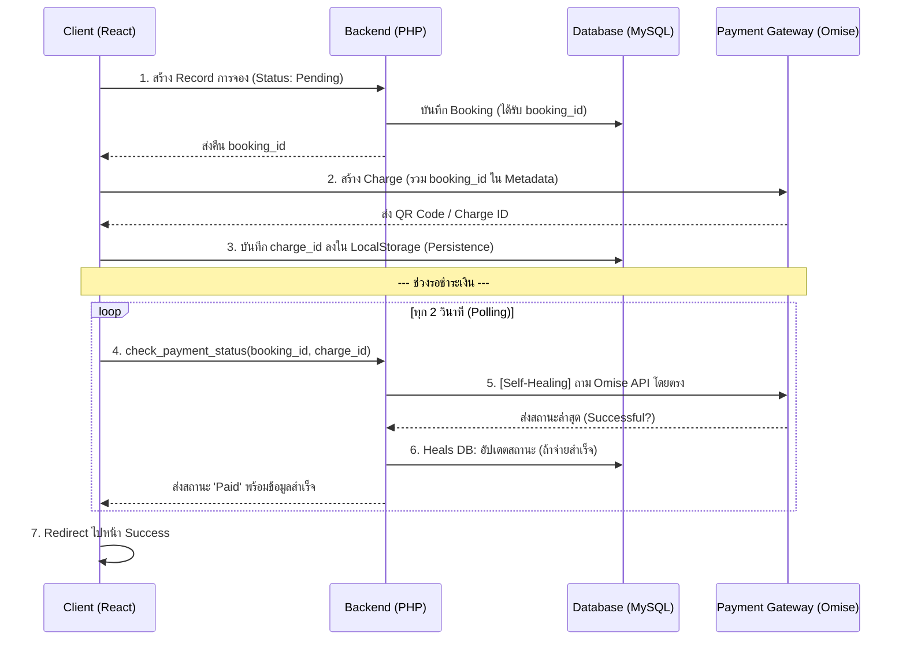

# 🛡️ Ultimate Guideline: 100% Reliable Payment Integration

คู่มือการวางโครงสร้างระบบชำระเงิน (Omise / Payment Gateway อื่นๆ) ให้มีความเสถียรสูงสุด รองรับทุก Error Case และเน็ตหลุด

---

## 1. ผังการทำงาน (System Architecture)
เพื่อให้ได้ความชัวร์ 100% เราต้องมีระบบ "ตรวจสอบซ้ำ (Double Check)" ระหว่าง Webhook และ Polling เสมอ



---

## 2. โครงสร้างฐานข้อมูล (Database Schema)
ต้องมีฟิลด์สำหรับเก็บ `transaction_ref` (Charge ID) เสมอ เพื่อใช้ตรวจสอบย้อนกลับจากฝั่ง Gateway

```sql
CREATE TABLE bookings (
    id INT AUTO_INCREMENT PRIMARY KEY,
    user_id INT NOT NULL,
    amount DECIMAL(10,2) NOT NULL,
    status ENUM('Pending', 'Paid', 'Cancelled') DEFAULT 'Pending',
    transaction_ref VARCHAR(255) NULL, -- เก็บความลับสวรรค์ (chrg_test_...)
    created_at TIMESTAMP DEFAULT CURRENT_TIMESTAMP,
    INDEX (transaction_ref)
);
```

---

## 3. หลักการฝั่ง Backend (The "Self-Healing" API)
กุญแจสำคัญคือ **"อย่าเชื่อแค่ฐานข้อมูลตัวเอง"** แต่ให้ถาม Gateway โดยตรงทุกครั้งที่มีคนถามสถานะ

### ✅ ตัวอย่าง PHP (api/index.php)
```php
function check_payment_status($booking_id, $charge_id) {
    // 1. ดึงข้อมูลจาก DB ตัวเองก่อน
    $booking = $db->getBooking($booking_id);
    
    // 2. ถ้าใน DB ยังเป็น Pending แต่มี Charge ID ให้ถาม Gateway ทันที (Self-Healing)
    if ($booking['status'] === 'Pending' && $charge_id) {
        $ch = curl_init("https://api.omise.co/charges/" . $charge_id);
        curl_setopt_array($ch, [
            CURLOPT_USERPWD        => OMISE_SECRET_KEY . ':',
            CURLOPT_RETURNTRANSFER => true,
            CURLOPT_TIMEOUT        => 5, // ห้ามนานเกินไป เดี๋ยว Polling ค้าง
            CURLOPT_SSL_VERIFYPEER => false // แก้ปัญหา SSL บน Server บางตัว
        ]);
        $response = json_decode(curl_exec($ch), true);
        
        // 3. ถ้าผลจาก Gateway บอกว่าสำเร็จ ให้ "Heal" ข้อมูลใน DB ทันที
        if ($response && ($response['status'] === 'successful' || $response['paid'])) {
            $db->updateStatus($booking_id, 'Paid', $charge_id);
            $booking['status'] = 'Paid';
        }
    }
    return $booking;
}
```

---

## 4. หลักการฝั่ง Frontend (The "Persistent" Poller)
ต้องรับมือกับ **"เน็ตหลุด"** และ **"การรีเฟรชหน้า"** ได้แบบไร้รอยต่อ

### ✅ เทคนิคที่ 1: LocalStorage Persistence
บันทึก `charge_id` และ `booking_id` ลงในเบราว์เซอร์ทันทีที่เริ่มจ่ายเงิน เพื่อให้ถ้ารีเฟรชหน้าหรือเน็ตหลุด ระบบจะยังกลับมา Polling ต่อได้จนจบ

### ✅ เทคนิคที่ 2: Adaptive Polling (React Example)
```javascript
useEffect(() => {
  if (step !== 'QR_SHOWING') return;

  const poll = setInterval(async () => {
    try {
      const res = await fetch(`api.php?action=check&id=${bookingId}&ref=${chargeId}`);
      if (!res.ok) throw new Error("Network issue"); // เน็ตแกว่ง? ไม่ต้องตกใจ ลองใหม่ใน 2 วิ
      
      const data = await res.json();
      setIsOffline(false); 

      if (data.status === 'Paid') {
        clearInterval(poll);
        showSuccessModal(); // จ่ายเงินสำเร็จ! ฉลอง! 🎉
      }
    } catch (err) {
      setIsOffline(true); // แสดงสถานะ "กำลังพยายามเชื่อมต่อใหม่..."
    }
  }, 2000); // 2 วินาทีกำลังดี ไม่ช้าไป ไม่หนัก Server

  return () => clearInterval(poll);
}, [step]);
```

---

## 5. Checklist ก่อนส่งงาน (Production Checklist)
1. [ ] **Webhook Backup:** ถึงจะทำ Polling แล้ว แต่ Webhook ก็ต้องเปิดทิ้งไว้เป็น Backup เสมอ (กรณีปิดมือถือแล้วไปทำอย่างอื่น)
2. [ ] **Atomic Transaction:** ทุกครั้งที่เปลี่ยนสถานะเป็น `Paid` ต้องอัปเดตทรัพยากรที่เกี่ยวข้อง (เช่น ตัดสต็อก, จองสนาม) ใน PHP Transaction เดียวกัน
3. [ ] **UX Status Bar:** ต้องมีข้อความบอกผู้ใช้ชัดเจนว่า "กำลังตรวจสอบยอดเงิน" และมีปุ่ม "เช็คสถานะทันที" เผื่อใจร้อน
4. [ ] **No Duplicate Charges:** ตรวจสอบว่าใน Session หนึ่งจะไม่โดนนำไปสร้าง `charge_id` ใหม่ซ้ำซ้อน (ถ้ามีของเดิมที่ยังไม่หมดอายุให้ใช้ของเดิม)

---

**สรุปสั้นๆ:** ระบบจ่ายเงินที่ดีที่สุดคือระบบที่ **"ขี้สงสัย"** (เช็ค Gateway ตลอด) และ **"จำแม่น"** (เก็บข้อมูลลง LocalStorage) ครับแก! 🦾🚀✨
